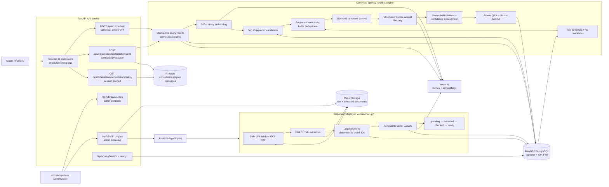

# LegalBot Current System Architecture

This diagram reflects the upgraded RAG implementation in the current working tree.

## Boundaries

- `app/rag_chatbot` is the only answer engine. The legacy synchronous `RagService` and `/api/v1/rag/ask` were removed.
- `/d4/*` is deliberately not mounted. Vector writes and queries are internal repository operations.
- Citation labels, pages, organizations, and links come from database records; Gemini may return only cited chunk IDs.
- The API publishes ingestion jobs and waits for Pub/Sub broker confirmation before returning `202`. It does not perform extraction in an in-process background thread.
- The worker is retry-safe: chunk IDs are deterministic and vector writes are upserts tagged with the configured embedding model.
- Agreement analysis and agreement generation remain separate product flows using Firestore, Cloud Storage, Pub/Sub, and Gemini.
